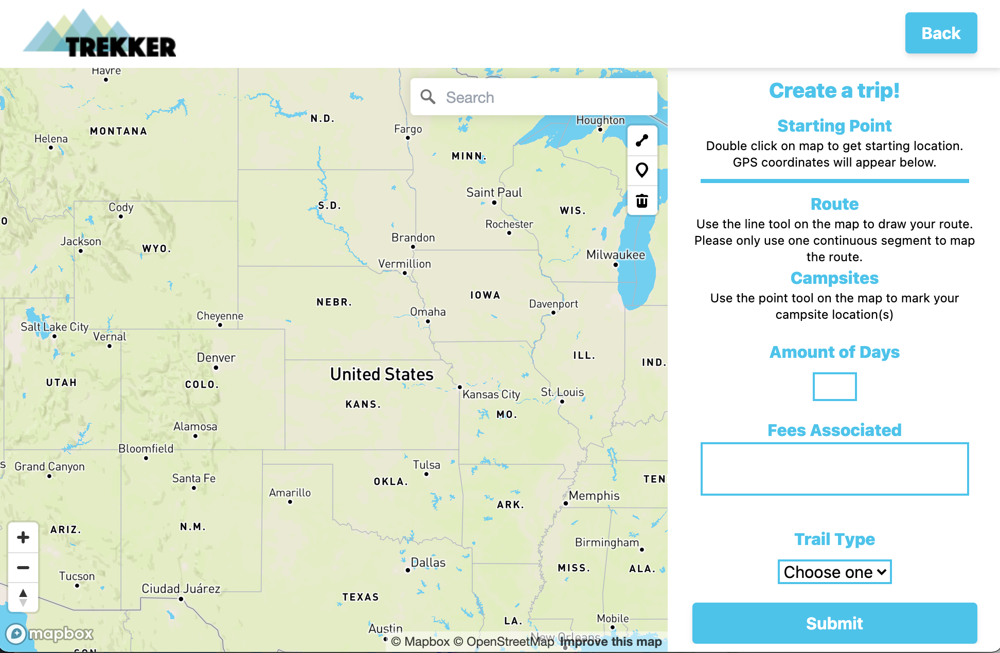

## trekker

There are many website out there that provide backpacking trips for very popular routes. There are not many options for those who go backpacking to get away from the crowds.
Enter trekker! Users would be able to draw out routes for backpacking trips that they have completed. Users can then search the location and find options for backpacking routes that may not be as popular!

A user would go to the landing page and be able to find previously entered routes. They are able to search locations within the map and get more details about a trip.


When the user finds the route that fits their preferences, they can go to the detail page for more information.


If a user wants to log a new route, they can press the "Add A Trip" button, and are redirected to the create page.


Users can start their route by double clicking on their starting location on the map. This creates a marker. Then the user can use the map tools to draw lines for their route. The points are used for locating campsites along their routes. The user can also add important information related to their routes.


[](https://www.youtube.com/watch?v=3yGpr5h5eoc)

## Getting Started

1. Clone this repo and enter!

   ```bash
   git clone https://github.com/krista-p/trekker.git
   cd trekker
   ```

2. Install dependencies.

   ```bash
   npm install
   cd backend			# ! Change into the backend folder !
   npm install
   cd ..
   cd trekker-app			# ! Change into the trekker-app folder !
   npm install
   ```

3. Create .env files based off of the envexample files in both the server and trekker-app folders.

4. While in the backend folder, run ````nodemon index.js```` to start the server and database connection.

5. While in the trekker-app folder, run ````npm run start```` to start the script for running the application locally.

## Tech Stack

# Frontend
* [React](https://reactjs.org/)
* [Mapbox](https://docs.mapbox.com/)
* [MapboxGL-Geocoder](https://github.com/mapbox/mapbox-gl-geocoder)
* [MapboxGL-Draw](https://github.com/mapbox/mapbox-gl-draw/)
* [TailwindCSS](https://tailwindcss.com/)

# Backend
* [Express](https://expressjs.com/)
* [MongoDB](https://docs.mongodb.com/)
* [MongooseJS](https://mongoosejs.com/docs/guide.html)